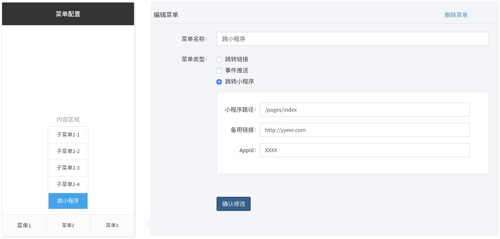

# An editor for WeChat Menu.

This is a `laravel-admin` extension that integrates [wx_menu](http://www.jq22.com/jquery-info21835) into `laravel-admin`.


## Screenshot



## Installation

First, install dependencies:

```bash
composer require yisonli/wxmenu
```

Then, publish the resource directory:
```bash
php artisan vendor:publish --tag=wxmenu --force
```

## Configuration

In the `extensions` section of the `config/admin.php` file, add some configuration that belongs to this extension.

```php
'extensions' => [
    'wxmenu' => [
        // set to false if you want to disable this extension
        'enable' => true,
    ]
]
```


## Usage

Use it in the form form:
```php
$form->wxmenu('content');
```

## License

Licensed under [The MIT License (MIT)] (LICENSE).